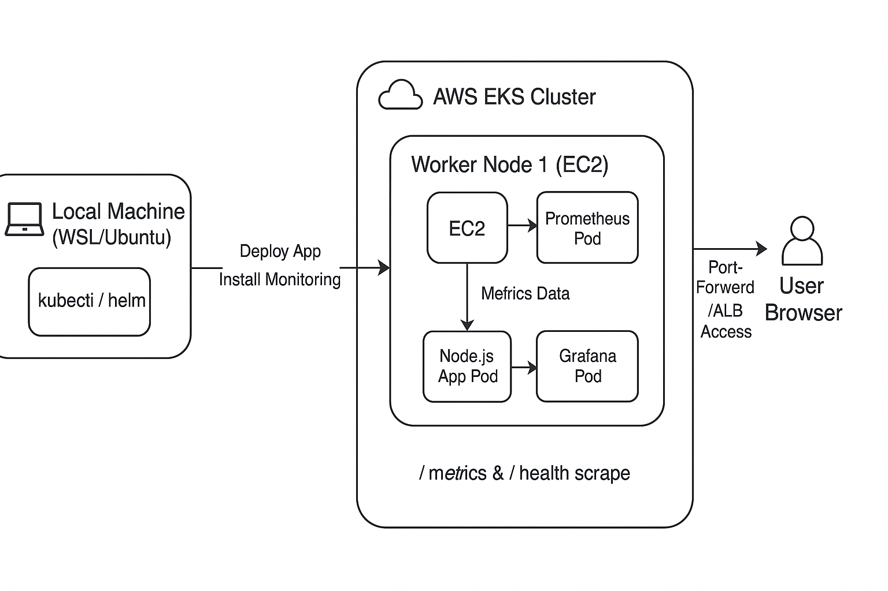

# 🚀 EKS + Node.js App + Prometheus + Grafana Monitoring

This project demonstrates how to:
1. Deploy a **Node.js application** to **AWS EKS** with `/` and `/health` routes.
2. Install **Prometheus** and **Grafana** inside the EKS cluster for monitoring.
3. Access Grafana locally (via port-forward) or expose it via ALB.

---

## 📌 Prerequisites

Make sure you have the following installed **on your local machine**:

- [AWS CLI](https://docs.aws.amazon.com/cli/latest/userguide/getting-started-install.html)
- [kubectl](https://kubernetes.io/docs/tasks/tools/install-kubectl/)
- [eksctl](https://eksctl.io/introduction/installation/)
- [Helm](https://helm.sh/docs/intro/install/)
- [Docker](https://docs.docker.com/get-docker/)

Also, you will need:
- An AWS account with permissions to create EKS, EC2, and ECR resources.
- Basic knowledge of Kubernetes and AWS.

---

## 1️⃣ Configure AWS CLI
```bash
aws configure
```
Enter:
- AWS Access Key ID
- AWS Secret Access Key
- Default region (e.g., `ap-south-1`)
- Output format: `json`

---

## 2️⃣ Create an EKS Cluster
```bash
eksctl create cluster   --name monitoring-demo   --region ap-south-1   --nodes 2   --node-type t3.medium   --managed
```
This will take **15–20 minutes**.

Verify:
```bash
kubectl get nodes
```

---

## 3️⃣ Build & Push Node.js App to ECR

**server.js**
```javascript
const express = require("express");
const app = express();

app.get("/", (req, res) => {
  res.json({ message: "Hello from EKS 🚀" });
});

app.get("/health", (req, res) => {
  res.status(200).json({ status: "UP" });
});

const PORT = process.env.PORT || 3000;
app.listen(PORT, () => console.log(`Server running on port ${PORT}`));
```

**package.json**
```json
{
  "name": "node-health-app",
  "version": "1.0.0",
  "main": "server.js",
  "scripts": {
    "start": "node server.js"
  },
  "dependencies": {
    "express": "^4.18.2"
  }
}
```

**Dockerfile**
```dockerfile
FROM node:18-alpine
WORKDIR /app
COPY package*.json ./
RUN npm install --production
COPY . .
EXPOSE 3000
CMD ["node", "server.js"]
```

---

### Create ECR Repository
```bash
aws ecr create-repository --repository-name node-health-app
```

### Authenticate Docker to ECR
```bash
aws ecr get-login-password --region ap-south-1 | docker login --username AWS --password-stdin <account-id>.dkr.ecr.ap-south-1.amazonaws.com
```

### Build & Push Image
```bash
docker build -t node-health-app .
docker tag node-health-app:latest <account-id>.dkr.ecr.ap-south-1.amazonaws.com/node-health-app:latest
docker push <account-id>.dkr.ecr.ap-south-1.amazonaws.com/node-health-app:latest
```

---

## 4️⃣ Deploy Node.js App to EKS

**node-app.yaml**
```yaml
apiVersion: apps/v1
kind: Deployment
metadata:
  name: node-health-app
spec:
  replicas: 2
  selector:
    matchLabels:
      app: node-health-app
  template:
    metadata:
      labels:
        app: node-health-app
    spec:
      containers:
        - name: node-health-app
          image: <account-id>.dkr.ecr.ap-south-1.amazonaws.com/node-health-app:latest
          ports:
            - containerPort: 3000
          readinessProbe:
            httpGet:
              path: /health
              port: 3000
            initialDelaySeconds: 5
            periodSeconds: 5
---
apiVersion: v1
kind: Service
metadata:
  name: node-health-service
spec:
  selector:
    app: node-health-app
  ports:
    - port: 3000
      targetPort: 3000
  type: LoadBalancer
```

Apply:
```bash
kubectl apply -f node-app.yaml
```

Check:
```bash
kubectl get svc node-health-service
```

---

## 5️⃣ Install Prometheus + Grafana in EKS

### Add Helm repo:
```bash
helm repo add prometheus-community https://prometheus-community.github.io/helm-charts
helm repo update
```

### Create lightweight config:
```bash
cat <<EOF > light-prometheus.yaml
grafana:
  resources:
    limits:
      memory: 256Mi
      cpu: 100m
    requests:
      memory: 128Mi
      cpu: 50m

prometheus:
  prometheusSpec:
    retention: 1d
    resources:
      limits:
        memory: 512Mi
        cpu: 250m
      requests:
        memory: 256Mi
        cpu: 100m
EOF
```

### Install:
```bash
helm install monitoring prometheus-community/kube-prometheus-stack -f light-prometheus.yaml
```

---

## 6️⃣ Access Grafana Locally

Get password:
```bash
kubectl get secret monitoring-grafana -o jsonpath="{.data.admin-password}" | base64 --decode ; echo
```

Port-forward:
```bash
kubectl port-forward svc/monitoring-grafana 3000:80
```

Login at: **http://localhost:3000**  
User: `admin`  
Pass: *(from above command)*

---

## 📊 Dashboards
In Grafana:
- Go to **Dashboards → Import**
- Import:
  - **315** → Kubernetes cluster monitoring
  - **1860** → Node exporter dashboard

---

## 🧹 Cleanup
```bash
helm uninstall monitoring
kubectl delete -f node-app.yaml
eksctl delete cluster --name monitoring-demo
```

---

## 📌 Architecture Diagram



---

## 📌 Notes
- All Helm commands are run **from local**, but resources are installed **inside EKS**.
- This setup is suitable for learning and small projects — adjust resources for production.
- For production, consider:
  - Higher resource limits for Prometheus and Grafana.
  - Persistent storage for Prometheus.
  - AWS Managed Prometheus & Grafana services.


Step 1: Add Metrics Support to Your Node.js App
We’ll use prom-client to expose /metrics in Prometheus format.

1️⃣ Install prom-client:

bash
Copy
Edit
npm install prom-client
2️⃣ Update your server.js (or index.js):

js
Copy
Edit
const express = require("express");
const client = require("prom-client");
const app = express();

// Create a Registry
const register = new client.Registry();

// Collect default system metrics (CPU, memory, etc.)
client.collectDefaultMetrics({ register });

// Home route
app.get("/", (req, res) => {
  res.send("Hello from Node.js App 🚀");
});

// Health check route
app.get("/health", (req, res) => {
  res.json({ status: "UP" });
});

// Metrics endpoint
app.get("/metrics", async (req, res) => {
  res.set("Content-Type", register.contentType);
  res.end(await register.metrics());
});

app.listen(3000, () => {
  console.log("Server running on port 3000");
});
Step 2: Dockerize Your App
Create a Dockerfile:

dockerfile
Copy
Edit
FROM node:18-alpine
WORKDIR /app
COPY package*.json ./
RUN npm install --production
COPY . .
EXPOSE 3000
CMD ["node", "server.js"]
Build and push to ECR:

bash
Copy
Edit
# Build
docker build -t nodejs-app .

# Tag
docker tag nodejs-app:latest <AWS_ACCOUNT_ID>.dkr.ecr.<REGION>.amazonaws.com/nodejs-app:latest

# Push
docker push <AWS_ACCOUNT_ID>.dkr.ecr.<REGION>.amazonaws.com/nodejs-app:latest
Step 3: Deploy Node.js App to EKS
Create a file nodejs-app.yaml:

yaml
Copy
Edit
apiVersion: apps/v1
kind: Deployment
metadata:
  name: nodejs-app
  namespace: monitoring
  labels:
    app: nodejs-app
spec:
  replicas: 1
  selector:
    matchLabels:
      app: nodejs-app
  template:
    metadata:
      labels:
        app: nodejs-app
    spec:
      containers:
        - name: nodejs-app
          image: <AWS_ACCOUNT_ID>.dkr.ecr.<REGION>.amazonaws.com/nodejs-app:latest
          ports:
            - containerPort: 3000
---
apiVersion: v1
kind: Service
metadata:
  name: nodejs-app
  namespace: monitoring
  labels:
    app: nodejs-app
spec:
  selector:
    app: nodejs-app
  ports:
    - name: http
      protocol: TCP
      port: 80
      targetPort: 3000
  type: ClusterIP
Apply it:

bash
Copy
Edit
kubectl apply -f nodejs-app.yaml
Step 4: Create ServiceMonitor for Prometheus
Create nodejs-servicemonitor.yaml:

yaml
Copy
Edit
apiVersion: monitoring.coreos.com/v1
kind: ServiceMonitor
metadata:
  name: nodejs-app-monitor
  namespace: monitoring
spec:
  selector:
    matchLabels:
      app: nodejs-app
  endpoints:
    - port: http
      path: /metrics
      interval: 15s
Apply it:

bash
Copy
Edit
kubectl apply -f nodejs-servicemonitor.yaml
Step 5: Verify Prometheus is Scraping Your App
Port-forward Prometheus:

bash
Copy
Edit
kubectl port-forward svc/monitoring-kube-prometheus-prometheus 9090:9090
Open http://localhost:9090 → Status → Targets.
You should see your nodejs-app target as UP.

Step 6: View in Grafana
Open Grafana:

bash
Copy
Edit
kubectl port-forward svc/monitoring-grafana 3000:80
→ Go to http://localhost:3000.
2. Data Sources → Prometheus → Already configured by Helm.
3. Import a dashboard:

Left Menu → Dashboards → + Import → Use ID: 1860 (Node Exporter Full) or create a custom one.

Add a panel with query:

promql
Copy
Edit
up{job="nodejs-app"}
You should see your app’s availability.
You can also query:

promql
Copy
Edit
process_cpu_user_seconds_total
process_resident_memory_bytes
to see CPU & memory usage of your Node.js app.

